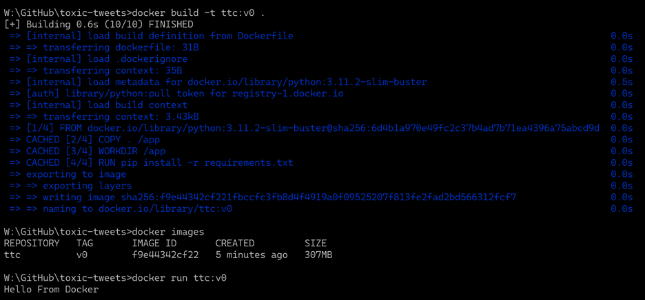

# _Toxic Tweets_
##### __Objective__ Focused on the study of negative online behaviors, like toxic comments using natural language processing models.

### _Installation Instructions:_ 
1. Download Docker Desktop
2. Update wsl2
3. Create docker file
4. Create requirements.txt file derived from venv
5. Modify Dockerfile to install all required packages
6. Create .dockerignore to exclude venv, etc. 
7. Build docker image
8. Rund docker container

### _Docker Installation Proof:_
